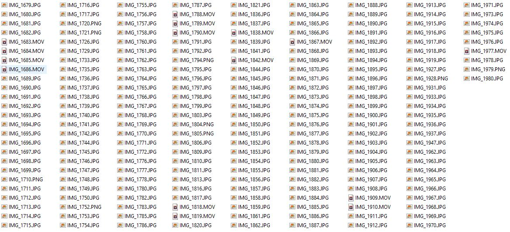
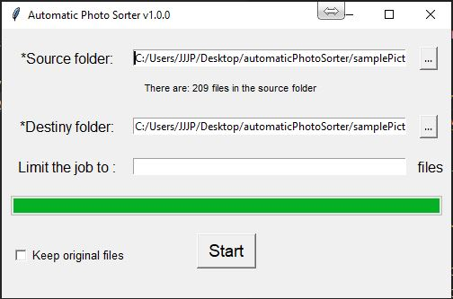
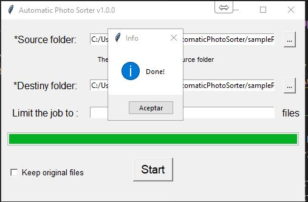
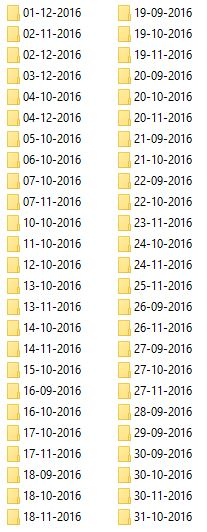
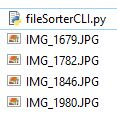
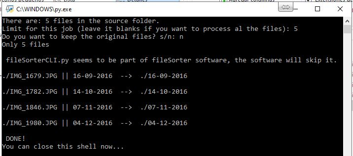
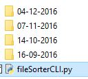

# Automatic Files Sorter By Date
This little personal project aims to be a tool to facilitate sorting my photos and videos. 
It sorts the files inside a folder by date and moves/copies them into new folders with the date as the name's folder. (Group by date).
It's useful helping you sorting photos and videos since it groups them by last date modification, then you only need to rename each folder.
Ok, you still have left work to do, but it is better renaming 25 folders than classifying 2000 files, don't you think so?

## Release notes

### Version 1.1
* Logs available in C:\ProgramData\FileSorter.
* Installer for Windows Os has been added. 
* Error and exception handling have been added.
* Some fixes and optimizations have been included.
#### GUI mode:
* Progress bar works fine now thanks to multithreading.
#### CLI mode:
* It lets you set the source and destiny folder.
* It lets you define the limit of files to be processed.
* CLI progress bar added thanks to multithreading. 

### Version 1.0
* There are two available modes: GUI and CLI
#### GUI mode:
* Lets you choose the source folder and the destiny folder
* Lets you specify the limit of files that you want for the current job.
* By changing the checkbox state, specify if you want to move or to copy the files
#### CLI mode:
* Works with the files in the same folder where the software is located
* It only asks you if you want to move or to copy the source files and the limit for the current job
* The result will appear in the same folder
* Hence, do not let you specify the source and destiny folder
* Pretends to be a quick solution for quick jobs.

## Building exe/out files (Windows Os only).
Open the project in Visual Studio 22 and build the solution. 
The .exe files and the installer will be created once the process is done.
For more details, check the prebuild steps of the Wix Installer project. 

## Screenshots
### GUI Mode:
Files Before using the software:

The software working:

The software when the job is done:

Files after using the software:

### CLI Mode
Files Before using the software:

The software working:

Files after using the software:

